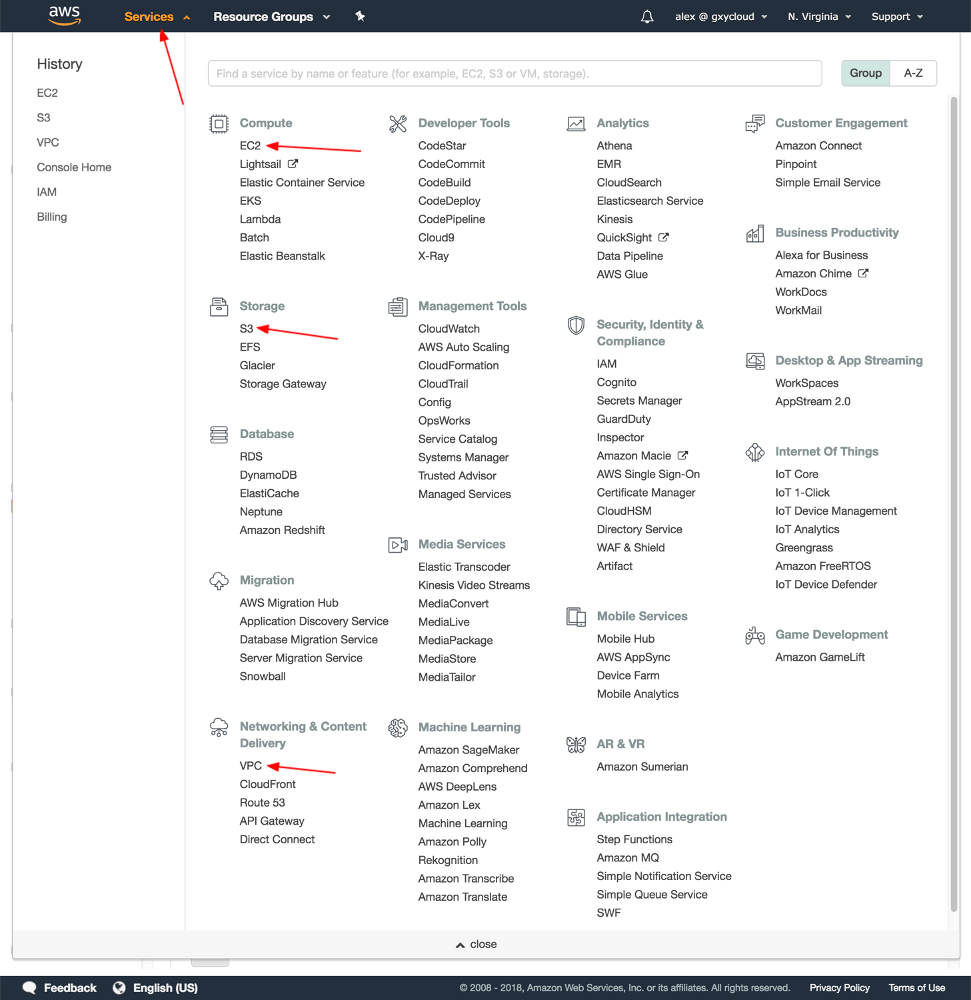
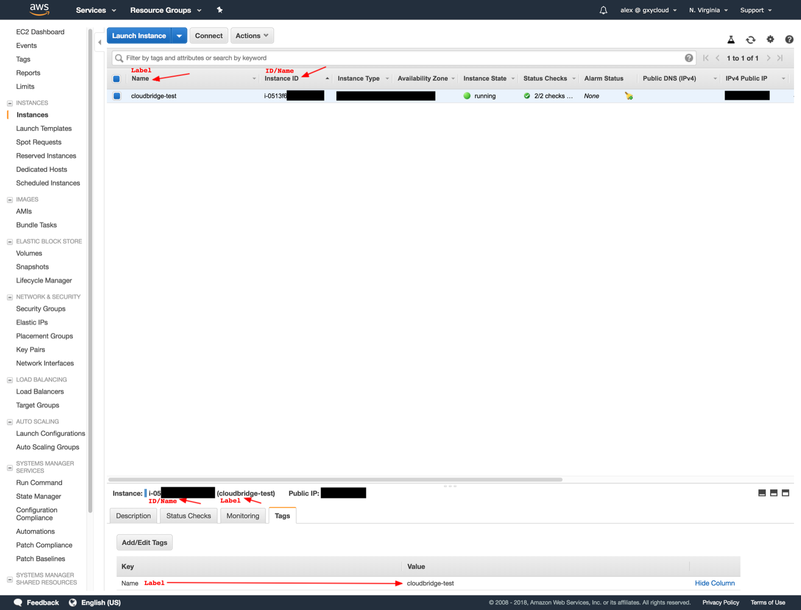
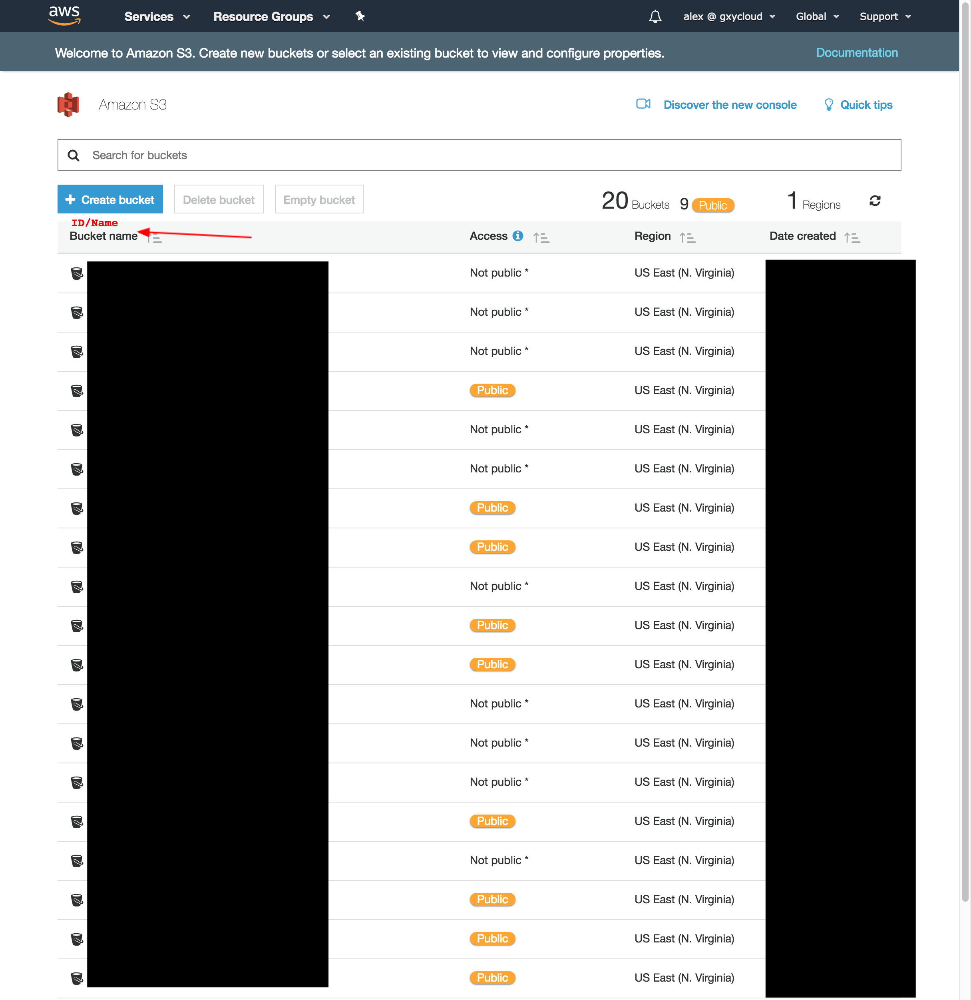

AWS Dashboard
-------------
AWS has a particular dashboard as resources are found within different
services. The following table lists the dashboard location of each resource,
and the below screenshot shows how the switch between the various services.

+------------------------+-----+
| Instance               | EC2 |
+------------------------+-----+
| MachineImage (Private) | EC2 |
+------------------------+-----+
| Volume                 | EC2 |
+------------------------+-----+
| Snapshot               | EC2 |
+------------------------+-----+
| VMFirewall             | EC2 |
+------------------------+-----+
| FloatingIP             | EC2 |
+------------------------+-----+
| KeyPair                | EC2 |
+------------------------+-----+
| VMFirewallRule         | EC2 |
+------------------------+-----+
| Network                | VPC |
+------------------------+-----+
| Subnet                 | VPC |
+------------------------+-----+
| Router                 | VPC |
+------------------------+-----+
| InternetGateway        | VPC |
+------------------------+-----+
| Bucket                 | S2  |
+------------------------+-----+
| BucketObject           | S2  |
+------------------------+-----+

   Resources in AWS are separated into three dashboards depending on the
   type of service handling the resources

AWS - Labeled Resources
-----------------------
+------------------------+-------------------+----------------+----------------+----------+
| Labeled Resource       | AWS Resource Type | CB ID          | CB Name        | CB Label |
+========================+===================+================+================+==========+
| AWSInstance            | Instance          | Instance ID    | Instance ID    | tag:Name |
+------------------------+-------------------+----------------+----------------+----------+
| AWSMachineImage        | AMI               | AMI ID         | AMI Name       | tag:Name |
+------------------------+-------------------+----------------+----------------+----------+
| AWSNetwork             | VPC               | VPC ID         | VPC ID         | tag:Name |
+------------------------+-------------------+----------------+----------------+----------+
| AWSSubnet              | Subnet            | Subnet ID      | Subnet ID      | tag:Name |
+------------------------+-------------------+----------------+----------------+----------+
| AWSRouter              | Route Table       | Route Table ID | Route Table ID | tag:Name |
+------------------------+-------------------+----------------+----------------+----------+
| AWSVolume              | Volume            | Volume ID      | Volume ID      | tag:Name |
+------------------------+-------------------+----------------+----------------+----------+
| AWSSnapshot            | Snapshot          | Snapshot ID    | Snapshot ID    | tag:Name |
+------------------------+-------------------+----------------+----------------+----------+
| AWSVMFirewall          | Security Group    | Group ID       | Group Name     | tag:Name |
+------------------------+-------------------+----------------+----------------+----------+

The resources listed above are labeled, they thus have both the `name` and
`label` properties in CloudBridge. These resources require a mandatory `label`
parameter at creation. For all labeled resources, the `label` property in AWS
maps to the tag with `key:Name`. However, unlike in Azure where all resources
have names, only some AWS resources have an unchangeable name by which to
identify them. Thus, for most AWS resources, the `name` property maps to the
ID, in order to preserve the concept of names being a unique identifier,
even if they are not easily readable in this context. For resources that do
support naming in AWS, the `name` will be generated from the `label` given at
creation, consisting of up to 55 characters from the label, followed by a UUID.
The label property can subsequently be changed, but the name property will
be set at creation and remain unchanged. Finally, labeled resources support
a `label` parameter for the `find` method in their corresponding services.
The below screenshots will help map these properties to AWS objects in the
web portal.

   The CloudBridge `name` and `ID` properties map to the unchangeable
   resource ID in AWS when the resource does not allow for an unchangeable
   name. The `label` property maps to the tag with key 'Name' for all
   resources in AWS. By default, this label will appear in the first
   column.

.. figure:: captures/az-ami-dash.png
   :alt: name, ID, and label properties for AWS EC2 AMIs

   When an AWS resource allows for an unchangeable name, the CloudBridge
   `ID` property maps to the Resource ID, while the `Name` property maps to
   the Resource Name. The `label` property maps to the tag with key 'Name'
   for all resources in AWS. By default, this label will appear in the first
   column.

AWS - Unlabeled Resources
---------------------------
+-----------------------+--------------------+-------+---------+----------+
| Unlabeled Resource    | AWS Resource Type  | CB ID | CB Name | CB Label |
+=======================+====================+=======+=========+==========+
| AWSKeyPair            | Key Pair           | Name  | Name    | -        |
+-----------------------+--------------------+-------+---------+----------+
| AWSBucket             | Bucket             | Name  | Name    | -        |
+-----------------------+--------------------+-------+---------+----------+
| AWSBucketObject       | Bucket Object      | Key   | Key     | -        |
+-----------------------+--------------------+-------+---------+----------+

The resources listed above are unlabeled. They thus only have the `name`
property in CloudBridge. These resources require a mandatory `name`
parameter at creation, which will directly map to the unchangeable `name`
property. Additionally, for these resources, the `ID` property also maps to
the `name` in AWS, as these resources don't have an `ID` in the
traditional sense and can be located by name. Finally, unlabeled resources
support a `name` parameter for the `find` method in their corresponding
services.

   Buckets can be found in the Amazon S3 portal. BucketObjects are contained
   within each Bucket.

AWS - Special Unlabeled Resources
-----------------------------------
+--------------------+------------------------+-------+------------------------------------------------------------------------+----------+
| Unlabeled Resource | AWS Resource Type      | CB ID | CB Name                                                                | CB Label |
+====================+========================+=======+========================================================================+==========+
| AWSFloatingIP      | Elastic IP             | ID    | [public_ip]                                                            | -        |
+--------------------+------------------------+-------+------------------------------------------------------------------------+----------+
| AWSInternetGateway | Internet Gateway       | ID    | tag:Name                                                               | -        |
+--------------------+------------------------+-------+------------------------------------------------------------------------+----------+
| AWSVMFirewallRule  | Network Security Rules | ID    | Generated: [direction]-[protocol]-[from_port]-[to_port]-[cidr]-[fw_id] | -        |
+--------------------+------------------------+-------+------------------------------------------------------------------------+----------+

While these resources are similarly unlabeled, they do not follow the same
general rules as the ones listed above. Firstly, they differ by the fact
that they take neither a `name` nor a `label` parameter at creation.
Moreover, each of them has other special properties.

The FloatingIP resource has a traditional resource ID, but instead of a
traditional name, its `name` property maps to its Public IP.
Moreover, the corresponding `find` method for Floating IPs can thus help
find a resource by `Public IP Address`.

In terms of the gateway, given that gateways are not their own objects in
other providers, we do not treat them like labeled resources in AWS although
they could support labels. Thus, the internet gateway create method does not
take a name parameter, and the `name` property is set automatically to a
default value. Note that since this value is stored in the tag with key Name,
the AWS dashboard does allow for its modification, although that is not
encouraged as the default name is expected for the
`get_or_create_inet_gateway` method.

Finally, Firewall Rules in AWS differ from traditional unlabeled resources
by the fact that they do not take a `name` parameter at creation, and the
`name` property is automatically generated from the rule's properties, as
shown above. These rules can be found within each Firewall (i.e. Security
Group) in the AWS EC2 portal, and will not have any name in the AWS dashboard

