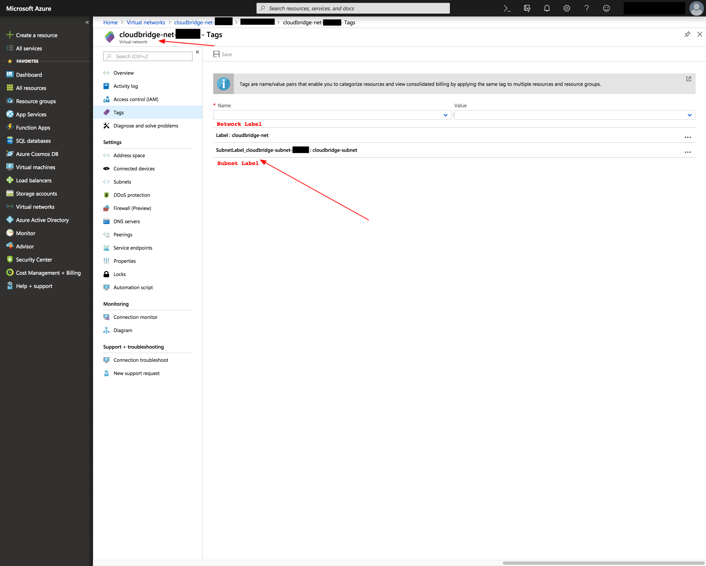

Azure - Labeled Resources
-------------------------
+---------------------------------------+------------------------+-------+------------------------+------------------------------------+
| Labeled CloudBridge Resource          | Azure Resource Type    | CB ID | CB Name                | CB Label                           |
+---------------------------------------+------------------------+-------+------------------------+------------------------------------+
| AzureInstance                         | Virtual Machine        | ID    | Name                   | tag:Label                          |
+---------------------------------------+------------------------+-------+------------------------+------------------------------------+
| AzureMachineImage (Private)           | Image                  | ID    | Name                   | tag:Label                          |
| AzureMachineImage (Marketplace Image) | VirtualMachineImage    | ID    | URN                    | URN                                |
+---------------------------------------+------------------------+-------+------------------------+------------------------------------+
| AzureNetwork                          | Virtual Network        | ID    | Name                   | tag:Label                          |
+---------------------------------------+------------------------+-------+------------------------+------------------------------------+
| AzureSubnet                           | Subnet                 | ID    | NetworkName/SubnetName | Network:tag:SubnetLabel_SubnetName |
+---------------------------------------+------------------------+-------+------------------------+------------------------------------+
| AzureRouter                           | Route Table            | ID    | Name                   | tag:Label                          |
+---------------------------------------+------------------------+-------+------------------------+------------------------------------+
| AzureVolume                           | Disk                   | ID    | Name                   | tag:Label                          |
+---------------------------------------+------------------------+-------+------------------------+------------------------------------+
| AzureSnapshot                         | Snapshot               | ID    | Name                   | tag:Label                          |
+---------------------------------------+------------------------+-------+------------------------+------------------------------------+
| AzureVMFirewall                       | Network security group | ID    | Name                   | tag:Label                          |
+---------------------------------------+------------------------+-------+------------------------+------------------------------------+

The resources listed above are labeled, they thus have both the `name` and
`label` properties in CloudBridge. These resources require a mandatory `label`
parameter at creation. The `label` will then be used to create the `name`,
which will consist of up to 55 characters from the label, followed by a UUID.
The label property can subsequently be changed, but the name property will
remain unchanged, as it is part of the ID. Finally, labeled resources support
a `label` parameter for the `find` method in their corresponding services.
The below screenshots will help map these properties to Azure objects in the
web portal.

.. figure:: captures/az-label-dash.png
   :scale: 50 %
   :alt: name and label properties in Azure portal

   The CloudBridge `name` property always maps to the unchangeable resource
   name in Azure. The `label` property maps to the tag with key 'Label' for
   most resources in Azure. By default, this label will appear in the tags
   column, but can also be made into its own column, using the feature
   pointed out in the screenshot above.

.. figure:: captures/az-net-id.png
   :scale: 50 %
   :alt: network id in Azure portal

   The CloudBridge `ID` property most often maps to the Resource ID in Azure,
   which can be found under the properties tab within a resource. The above
   screenshot shows where to find a resource's ID in Azure's web portal.

.. figure:: captures/az-net-label.png
   :scale: 50 %
   :alt: network label in Azure portal

   The CloudBridge `label` property most often maps to the tag with key
   'Label' in Azure, which can be found under the tags tab within a resource.
   The above screenshot shows where to find a resource's label in Azure's
   web portal.

Two labeled resources are exceptions to the general trends presented above,
namely public images (i.e. Azure Marketplace Images) and subnets.

These public images can be found in the Azure Marketplace, and cannot be
found on a user's dashboard. A Marketplace Image can be passed either by URN,
or by public ID, and does not need to be linked to a user. While all
Marketplace images will not be be listed by the find or list methods at the
moment, a pre-set list of popular images is built into CloudBridge for that
purpose. However, one can choose to list all Marketplace Images using the
`list_marketplace_images` function in the azure client. Specifically,
this can be done as follows:

.. code-block:: python

    # List all images
    # Note that in September 2018, around 10 minutes of wall time were required
    # to fetch the entire list
    provider.azure_client.list_marketplace_images()
    # List all images published by Canonical
    provider.azure_client.list_marketplace_images(publisher='Canonical')
    # List all Ubuntu images
    provider.azure_client.list_marketplace_images(publisher='Canonical',
                                                  offer='UbuntuServer')
    # List all Ubuntu 16.04 images
    provider.azure_client.list_marketplace_images(publisher='Canonical',
                                                  offer='UbuntuServer',
                                                  sku='16.04.0-LTS')
    # The ID of the listed object can then be used to retrieve an instance
    img = provider.compute.images.get
            ('/Subscriptions/{subscriptionID}/Providers/Microsoft.Compute/\
            Locations/{regionName}/Publishers/Canonical/ArtifactTypes/VMImage\
            /Offers/UbuntuServer/Skus/16.04.0-LTS/Versions/16.04.201808140')
    # The URN can also be used instead if it is already known
    # When the latest version is desired, it can be retrieved with the
    # keyword 'latest' in the URN without specifying a version
    img = provider.compute.images.get(
          'Canonical:UbuntuServer:16.04.0-LTS:latest')

Given that these resources are not owned by the user, they can only be
referenced and all setters will silently pass. CloudBridge properties `name`
and `label` will map to the URN, while the `ID` will map to the public `ID`.
It is also important to note that some of these resources are paid and
required a plan to use, while others are free but likewise require accepting
certain terms before being used. These plans and terms are passed and
accepted silently by CloudBridge in order to keep the code cloud-independent.
We therefore encourage using the `marketplace website<https://azuremarketplace.microsoft.com/en-us>`_
to view image and plan details before using them in CloudBridge.

Additionally, Subnets are a particular resource in Azure because they are
not simply found in the Resource Group like most resources, but are rather
nested within a network. Moreover, Subnets do not support tags in Azure.
However, they remain a labeled resource in CloudBridge, which was
accomplished by creating Network tags holding Subnet labels in Azure. The
below screenshots will show how to find Subnets and their labels in the
Azure web portal.

.. figure:: captures/az-subnet-name.png
   :scale: 50 %
   :alt: subnet name in Azure portal

   The CloudBridge `name` property for Subnets corresponds to the
   unchangeable Resource Name in Azure. However, unlike other resources
   where the Azure Name maps directly to the `name` property alone, a Subnet's
   `name` property returns the Network's name and the Subnet's name,
   separated by a slash, thus having the format [networkName]/[subnetName].
   Subnets are additionally not found in the default resource list, but are
   rather nested within a Network, in the Subnets tab as shown above.

   The CloudBridge `label` property most often maps to the tag with key
   'Label' in Azure, which can be found under the tags tab within a resource.
   However, given that Subnets can't hold tags themselves, we set their tags
   in the Network with which they are associated. The tag name 'Label' thus
   corresponds to the Network's label, while each contained Subnet will have
   a corresponding tag with the name 'SubnetLabel_[subnetName]'.

Azure - Unlabeled Resources
---------------------------
+--------------------+----------------------------------------+-------+---------+----------+
| Unlabeled Resource | Azure Resource Type                    | CB ID | CB Name | CB Label |
+--------------------+----------------------------------------+-------+---------+----------+
| AzureKeyPair       | StorageAccount:Table                   | Name  | Name    | -        |
+--------------------+----------------------------------------+-------+---------+----------+
| AzureBucket        | StorageAccount:BlobContainer           | Name  | Name    | -        |
+--------------------+----------------------------------------+-------+---------+----------+
| AzureBucketObject  | StorageAccount:BlobContainer:BlockBlob | Name  | Name    | -        |
+--------------------+----------------------------------------+-------+---------+----------+

The resources listed above are unlabeled. They thus only have the `name`
property in CloudBridge. These resources require a mandatory `name`
parameter at creation, which will directly map to the unchangeable `name`
property. Additionally, for these resources, the `ID` property also maps to
the `name` in Azure, as these resources don't have an `ID` in the
traditional sense and can be located simply by name. Finally, unlabeled
resources support a `name` parameter for the `find` method in their
corresponding services.

.. figure:: captures/az-storacc.png
   :scale: 50 %
   :alt: storage account in Azure portal

   Bucket and Key Pair objects are different than other resources in Azure,
   as they are not resources simply residing in a resource group, but are
   rather found in a storage account. As a result of this difference, these
   resources do not support labels, and cannot be seen on the default
   dashboard. In order to find these resources in the Azure web portal, one
   must head to the storage account containing them, and look in the `Blobs`
   and `Tables` services respectively for `Buckets` and `KeyPairs`.

Azure - Special Unlabeled Resources
-----------------------------------
+-------------------------+------------------------+--------------------+--------------------+----------+
| Unlabeled Resource      | Azure Resource Type    | CB ID              | CB Name            | CB Label |
+-------------------------+------------------------+--------------------+--------------------+----------+
| AzureFloatingIP         | Public IP Address      | ID                 | [public_ip]        | -        |
+-------------------------+------------------------+--------------------+--------------------+----------+
| AzureInternetGateway    | None                   | cb-gateway-wrapper | cb-gateway-wrapper | -        |
+-------------------------+------------------------+--------------------+--------------------+----------+
| AzureVMFirewallRule     | Network Security Rules | ID                 | name               | -        |
+-------------------------+------------------------+--------------------+--------------------+----------+

While these resources are similarly unlabeled, they do not follow the same
general rules as the ones listed above. Firstly, they differ by the fact
that they take neither a `name` nor a `label` parameter at creation.
Moreover, each of them has other special properties.

The FloatingIP resource has a traditional resource ID, but instead of a
traditional name, its `name` property maps to its Public IP. Thus, the name
seen in the Azure web portal will not map to the CloudBridge name, but will
rather be auto-generated, while the Azure `IP Address` will map to CloudBridge
name. Moreover, the corresponding `find` method for Floating IPs can thus help
find a resource by `Public IP Address`, and the get method also accepts a
'Public IP' instead of an 'ID'.

In terms of the gateway, one of the major discrepancies in Azure is the
non-existence of an InternetGateway. In fact, Azure resources are exposed
with no need for an Internet gateway. However, in order to keep resources
consistent across providers, the CloudBridge Gateway resource exists
regardless of provider. For Azure, the gateway object created through
CloudBridge will not appear on the dashboard, but will rather be a cached
CloudBridge-level wrapper object.
For a succinct comparison between AWS Gateways and Azure, see `this answer
<https://social.msdn.microsoft.com/Forums/en-US/
814ccee0-9fbb-4c04-8135-49d0aaea5f38/
equivalent-of-aws-internet-gateways-in-azure?
forum=WAVirtualMachinesVirtualNetwork>`_.

Finally, Firewall Rules in Azure differ from traditional unlabeled
resources by the fact that they do not take a `name` parameter at creation.
These rules can be found within each Firewall (i.e. Security Group) in the
Azure web portal, and will have an automatically generated `name` of the form
'cb-rule-[int]'.