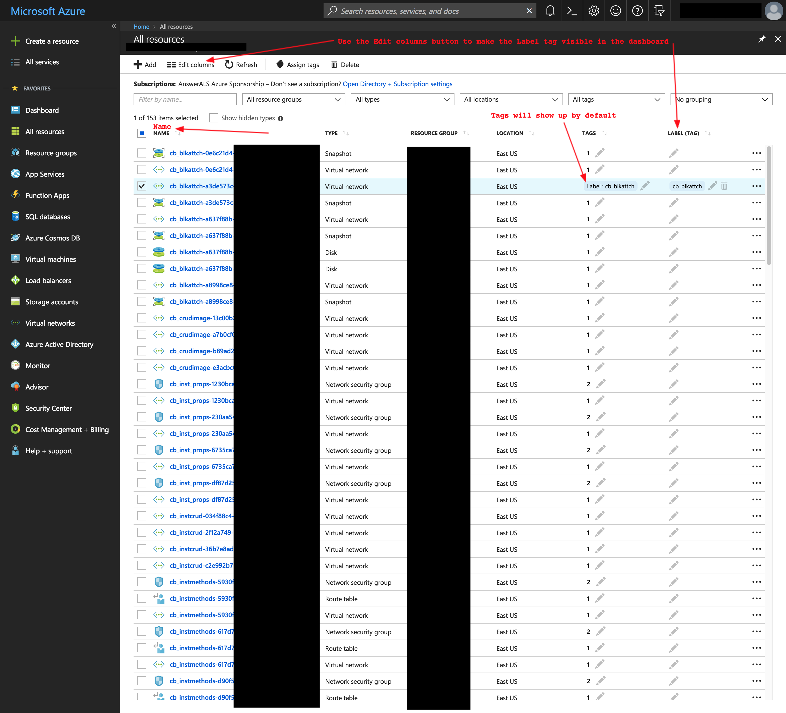
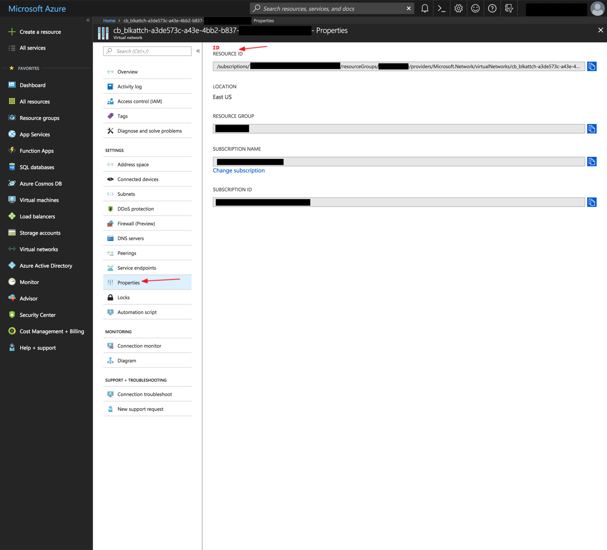
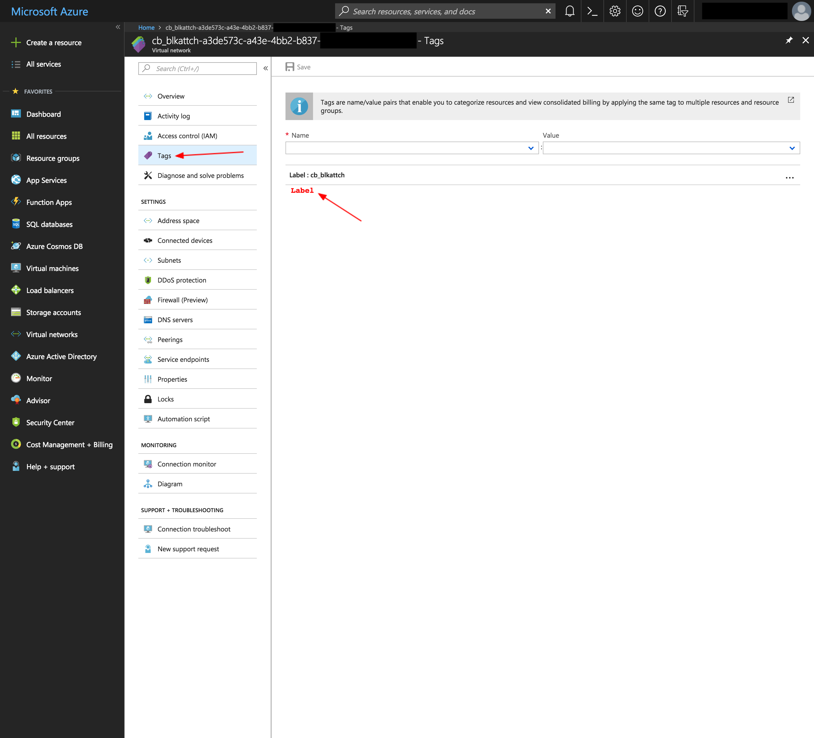
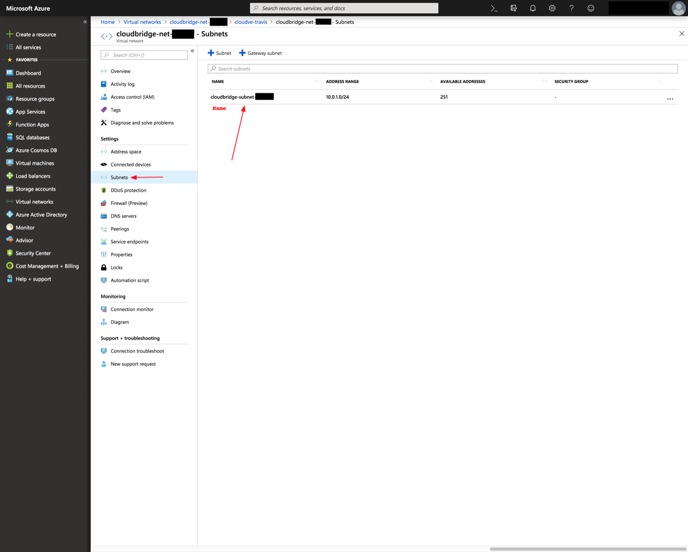
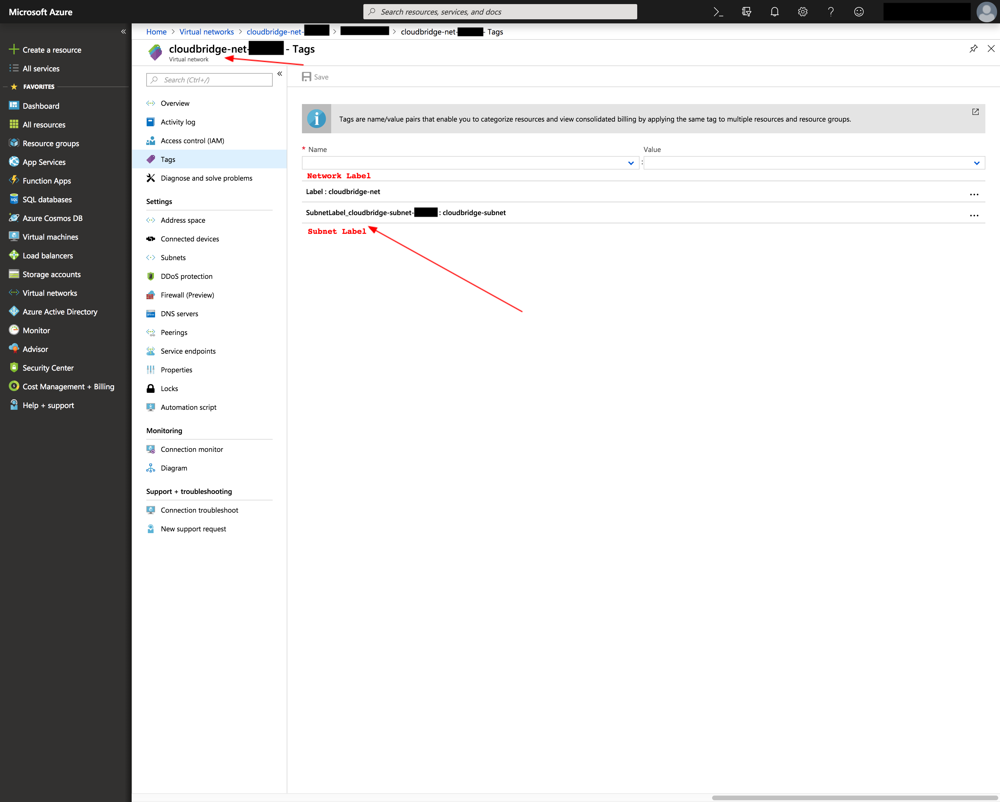
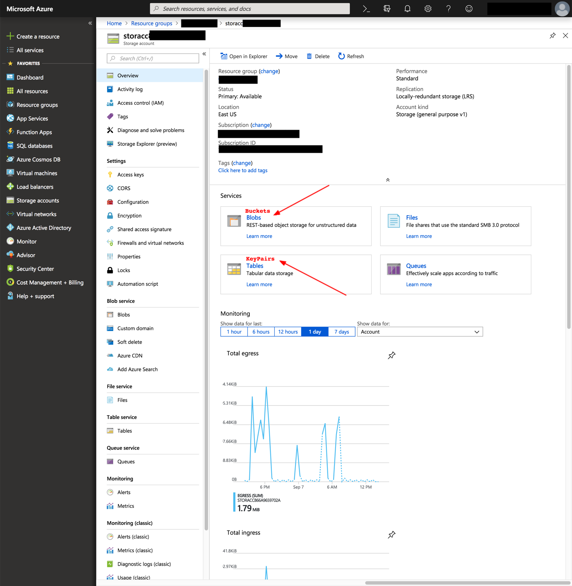

Dashboard Mapping
=================

Cross-Platform Concepts
-----------------------

Given CloudBridge's goal to work uniformly across cloud providers, some
compromises were necessary in order to bridge the many differences between
providers' resources and features. Notably, in order to create a robust and
conceptually consistent cross-cloud library, resources were given three main
properties: ID, name, and label.
The `ID` corresponds to a unique identifier that can be reliably used to
reference a resource. Users can safely use an ID knowing that it will always
point to the same resource.
The `name` property corresponds to an unchangeable and unique designation for
a particular resource. This property is meant to be, in some ways, a more
human-readable identifier. However, when no conceptually comparable property
exists for a given resource in a particular provider, the ID is returned
instead, as is the case for OpenStack resources. When the name can be
determined by a user at resource creation, either the name parameter will be
used for resources that support it, or the label will be used, when provided
as a prefix, with an appended uuid to ensure that the name remains unique.
The `label` property, conversely, is a changeable value that does not need
to be unique. Unlike the name property, it is not used to identify a
particular resource, but rather label a resource for easier distinction. It
is however important to note that not all resources support labels. When
supported, labels given at creation will also be used as a prefix to the name.

Properties per Resource per Provider
------------------------------------
The sections below will present a summary table detailing the CloudBridge
properties implemented for each resource, and their corresponding value in
the provider's dashboard. It will also delineate the different types of
CloudBridge resources, as well as present some design decisions made to
preserve consistency across providers.

Azure - Labeled Resources
-------------------------
+----------------------------------+------------------------+-------+------------------------+------------------------------------+
| Labeled CloudBridge Resource     | Azure Resource Type    | CB ID | CB Name                | CB Label                           |
+----------------------------------+------------------------+-------+------------------------+------------------------------------+
| Instance                         | Virtual Machine        | ID    | Name                   | tag:Label                          |
+----------------------------------+------------------------+-------+------------------------+------------------------------------+
| MachineImage (Private)           | Image                  | ID    | Name                   | tag:Label                          |
| MachineImage (Gallery Reference) | Gallery Reference      | URN   | URN                    | URN                                |
+----------------------------------+------------------------+-------+------------------------+------------------------------------+
| Network                          | Virtual Network        | ID    | Name                   | tag:Label                          |
+----------------------------------+------------------------+-------+------------------------+------------------------------------+
| Subnet                           | Subnet                 | ID    | NetworkName/SubnetName | Network:tag:SubnetLabel_SubnetName |
+----------------------------------+------------------------+-------+------------------------+------------------------------------+
| Router                           | Route Table            | ID    | Name                   | tag:Label                          |
+----------------------------------+------------------------+-------+------------------------+------------------------------------+
| Volume                           | Disk                   | ID    | Name                   | tag:Label                          |
+----------------------------------+------------------------+-------+------------------------+------------------------------------+
| Snapshot                         | Snapshot               | ID    | Name                   | tag:Label                          |
+----------------------------------+------------------------+-------+------------------------+------------------------------------+
| VMFirewall                       | Network security group | ID    | Name                   | tag:Label                          |
+----------------------------------+------------------------+-------+------------------------+------------------------------------+

The resources listed above are labeled. They thus have both the `name` and
`label` properties in CloudBridge. These resources require a mandatory `label`
parameter at creation. The `label` will then be used to create the `name`,
which will consist of up to 55 characters from the label, followed by a UUID.
The label property can subsequently be changed, but the name property will
remain unchanged, as it is part of the ID. Finally, labeled resources support
a `label` parameter for the `find` method in their corresponding services.
The below screenshots will help map these properties to Azure objects in the
web portal.

   The CloudBridge `name` property always maps to the unchangeable resource
   name in Azure. The `label` property maps to the tag with key 'Label' for
   most resources in Azure. By default, this label will appear in the tags
   column, but can also be made into its own column, using the feature
   pointed out in the screenshot above.

   The CloudBridge `ID` property most often maps to the Resource ID in Azure,
   which can be found under the properties tab within a resource. The above
   screenshot shows where to find a resource's ID in Azure's web portal.

   The CloudBridge `label` property most often maps to the tag with key
   'Label' in Azure, which can be found under the tags tab within a resource.
   The above screenshot shows where to find a resource's label in Azure's
   web portal.

Two labeled resources are exceptions to the general trends presented above,
namely public images (i.e. Azure Marketplace Gallery References) and subnets.

Gallery Images are public images from the Azure Marketplace, and cannot be
found on a user's dashboard. A Gallery Image Reference is passed by URN, and
does not need to be linked to a user. While all Gallery Image References cannot
yet be listed in CloudBridge, a pre-set list of popular images is built into
CloudBridge. For more on listing images through the Azure CLI, see the
`Microsoft Documentation here. <https://docs.microsoft
.com/en-us/azure/virtual-machines/linux/
cli-ps-findimage#list-popular-images.>`_ Given that these resources are not
owned by the user, they can only be referenced by URN. All CloudBridge
properties map to the URN and none of them can be set or changed.

Additionally, Subnets are a particular resource in Azure because they are
not simply found in the Resource Group like most resources, but are rather
nested within a network. Moreover, Subnets do not support tags in Azure.
However, they remain a labeled resource in CloudBridge, which was
accomplished by creating Network tags holding Subnet labels in Azure. The
below screenshots will show how to find Subnets and their labels in the
Azure web portal.

   The CloudBridge `name` property for Subnets corresponds to the
   unchangeable Resource Name in Azure. However, unlike other resources
   where the Azure Name maps directly to the `name` property alone, a Subnet's
   `name` property returns the Network's name and the Subnet's name,
   separated by a slash, thus having the format [networkName]/[subnetName].
   Subnets are additionally not found in the default resource list, but are
   rather nested within a Network, in the Subnets tab as shown above.

   The CloudBridge `label` property most often maps to the tag with key
   'Label' in Azure, which can be found under the tags tab within a resource.
   However, given that Subnets can't hold tags themselves, we set their tags
   in the Network with which they are associated. The tag name 'Label' thus
   corresponds to the Network's label, while each contained Subnet will have
   a corresponding tag with the name 'SubnetLabel_[subnetName]'.

Azure - Unlabeled Resources
---------------------------
+--------------------+----------------------------------------+-------+---------+----------+
| Unlabeled Resource | Azure Resource Type                    | CB ID | CB Name | CB Label |
+--------------------+----------------------------------------+-------+---------+----------+
| KeyPair            | StorageAccount:Table                   | Name  | Name    | -        |
+--------------------+----------------------------------------+-------+---------+----------+
| Bucket             | StorageAccount:BlobContainer           | Name  | Name    | -        |
+--------------------+----------------------------------------+-------+---------+----------+
| BucketObject       | StorageAccount:BlobContainer:BlockBlob | Name  | Name    | -        |
+--------------------+----------------------------------------+-------+---------+----------+

The resources listed above are unlabeled. They thus only have the `name`
property in CloudBridge. These resources require a mandatory `name`
parameter at creation, which will directly map to the unchangeable `name`
property. Additionally, for these resources, the `ID` property also maps to
the `name` in Azure, as these resources don't have an `ID` in the
traditional sense and can be located simply by name. Finally, unlabeled
resources support a `name` parameter for the `find` method in their
corresponding services.

   Bucket and Key Pair objects are different than other resources in Azure,
   as they are not resources simply residing in a resource group, but are
   rather found in a storage account. As a result of this difference, these
   resources do not support labels, and cannot be seen on the default
   dashboard. In order to find these resources in the Azure web portal, one
   must head to the storage account containing them, and look in the `Blobs`
   and `Tables` services respectively for `Buckets` and `KeyPairs`.

Azure - Special Unlabeled Resources
-----------------------------------
+--------------------+------------------------+--------------------+--------------------+----------+
| Unlabeled Resource | Azure Resource Type    | CB ID              | CB Name            | CB Label |
+--------------------+------------------------+--------------------+--------------------+----------+
| FloatingIP         | Public IP Address      | ID                 | [public_ip]        | -        |
+--------------------+------------------------+--------------------+--------------------+----------+
| InternetGateway    | None                   | cb-gateway-wrapper | cb-gateway-wrapper | -        |
+--------------------+------------------------+--------------------+--------------------+----------+
| VMFirewallRule     | Network Security Rules | ID                 | name               | -        |
+--------------------+------------------------+--------------------+--------------------+----------+

While these resources are similarly unlabeled, they do not follow the same
general rules as the ones listed above. Firstly, they differ by the fact
that they take neither a `name` nor a `label` parameter at creation.
Moreover, each of them has other special properties.
The FloatingIP resource has a traditional resource ID, but instead of a
traditional name, its `name` property maps to its Public IP. Thus, the name
seen in the Azure web portal will not map to the CloudBridge name, but will
rather be auto-generated, while the Azure `IP Address` will map to CloudBridge
name. Moreover, the corresponding `find` method for Floating IPs can thus help
find a resource by `Public IP Address`, and the get method also accepts a
'Public IP' instead of an 'ID'.

In terms of the gateway, one of the major discrepancies in Azure is the
non-existence of an InternetGateway. In fact, Azure resources are exposed
with no need for an Internet gateway. However, in order to keep resources
consistent across providers, the CloudBridge Gateway resource exists
regardless of provider. For Azure, the gateway object created through
CloudBridge will not appear on the dashboard, but will rather be a cached
CloudBridge-level wrapper object.
For a succinct comparison between AWS Gateways and Azure, see `this answer
<https://social.msdn.microsoft.com/Forums/en-US/
814ccee0-9fbb-4c04-8135-49d0aaea5f38/
equivalent-of-aws-internet-gateways-in-azure?
forum=WAVirtualMachinesVirtualNetwork>`_.

Finally, Firewall Rules in Azure differ from traditional unlabeled
resources by the fact that they do not take a `name` parameter at creation.
These rules can be found within each Firewall (i.e. Security Group) in the
Azure web portal, and will have an automatically generated `name` of the form
'cb-rule-[int]'.
