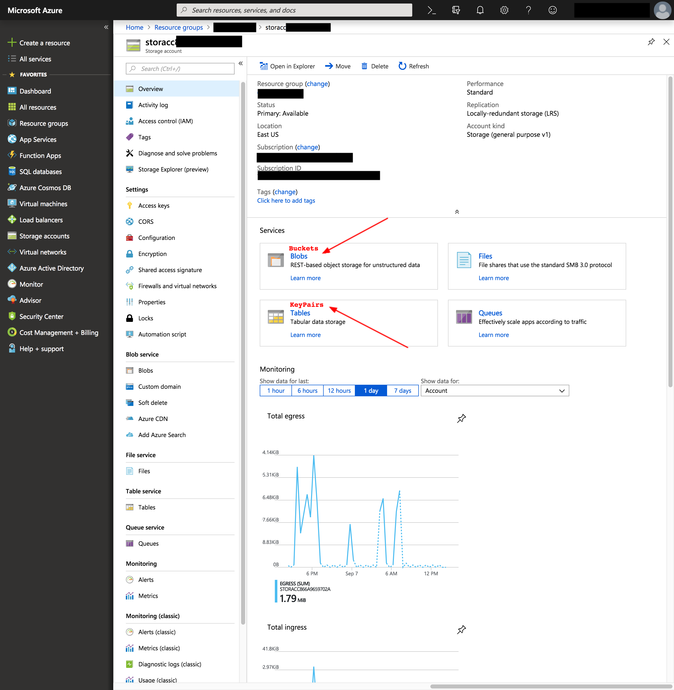

Dashboard Mapping
=================

Cross-Platform Concepts
-----------------------

Given cloudbridge's goal to work uniformly across cloud providers, some
compromises were necessary in order to bridge the many differences between
providers' resources and features. Notably, in order to create a robust and
conceptually consistent cross-cloud library, resources were given three main
properties: ID, name, and label.
The `ID` corresponds to a unique identifier that can be reliably used to
reference a resource. Users can safely use an ID knowing that it will always
point to the same resource.
The `name` property corresponds to an unchangeable and unique designation for
a particular resource. This property is meant to be, in some ways, a more
human-readable identifier. However, when no conceptually comparable property
exists for a given resource in a particular provider, the ID is returned
instead, as is the case for OpenStack resources. When the name can be
determined by a user at resource creation, either the name parameter will be
used for resources that support it, or the label will be used, when provided
as a prefix, with an appended uuid to ensure that the name remains unique.
The `label` property, conversely, is a changeable value that does not need
to be unique. Unlike the name property, it is not used to identify a
particular resource, but rather label a resource for easier distinction. It
is however important to note that not all resources support labels. When
supported, labels given at creation will also be used as a prefix to the name.

Properties per Resource per Provider
------------------------------------
The sections below will present a summary table detailing the cloudbridge
properties implemented for each resource, and their corresponding value in
the provider's dashboard.

Azure
-----
+-----------------------------------+-------+---------------+---------------+
| CloudServiceType                 	| CB_ID	| CB_Name      	| CB_Label  	|
+===================================+=======+===============+===============+
| Instance                         	| ID   	| Name       	| Tags:Label 	|
+-----------------------------------+-------+---------------+---------------+
| MachineImage (Private)           	| ID   	| Name       	| Tags:Label 	|
| MachineImage (Gallery Reference) 	| URN  	| URN        	| URN        	|
+-----------------------------------+-------+---------------+---------------+
| Network                          	| ID   	| Name       	| Tags:Label 	|
+-----------------------------------+-------+---------------+---------------+
| Subnet                           	| ID   	| Name       	| Tags:Label 	|
+-----------------------------------+-------+---------------+---------------+
| FloatingIP                       	| ID   	| Name       	| Tags:Label 	|
+-----------------------------------+-------+---------------+---------------+
| Router                           	| ID   	| Name       	| Tags:Label 	|
+-----------------------------------+-------+---------------+---------------+
| InternetGateway                  	| None 	| None       	| -          	|
+-----------------------------------+-------+---------------+---------------+
| Volume                           	| ID   	| Name       	| Tags:Label 	|
+-----------------------------------+-------+---------------+---------------+
| Snapshot                         	| ID   	| Name       	| Tags:Label 	|
+-----------------------------------+-------+---------------+---------------+
| KeyPair                          	| Name 	| Name       	| -          	|
+-----------------------------------+-------+---------------+---------------+
| VMFirewall                       	| ID   	| Name       	| Tags:Label 	|
+-----------------------------------+-------+---------------+---------------+
| VMFirewallRule                   	| ID   	| Name       	| -          	|
+-----------------------------------+-------+---------------+---------------+
| Bucket                           	| Name 	| Name       	| -          	|
+-----------------------------------+-------+---------------+---------------+
| BucketObject                     	| Name 	| Name       	| -          	|
+-----------------------------------+-------+---------------+---------------+

One of the major discrepancies in Azure is the non-existence of an Internet
Gateway. In fact, Azure resources are automatically exposed to the internet,
and thus an internet gateway object is not necessary for this purpose. Thus,
a gateway object created through cloudbridge in Azure will not appear on the
dashboard, as a cloudbridge-level wrapper object is returned when trying to
create or get a gateway, but no object corresponds to that concept in Azure.
For a succinct comparison between AWS Gateways and Azure, see:
https://social.msdn.microsoft.com/Forums/en-US/
814ccee0-9fbb-4c04-8135-49d0aaea5f38/
equivalent-of-aws-internet-gateways-in-azure?
forum=WAVirtualMachinesVirtualNetwork

.. figure:: captures/az-label-dash.png
   :scale: 50 %
   :alt: name and label properties in Azure portal

   The cloudbridge `name` property always maps to the unchangeable resource
   name in Azure. The `label` property maps to the tag with key 'Label' in
   Azure. By default, this label will appear in the tags column, but can also
   be made into its own column, following the button indicated in the
   screenshot above.

.. figure:: captures/az-net-id.png
   :scale: 50 %
   :alt: network id in Azure portal

   The cloudbridge `ID` property most often maps to the Resource ID in Azure,
   which can be found under the properties tab within a resource. The above
   screenshot shows where to find a resource's label in Azure's web portal

.. figure:: captures/az-net-label.png
   :scale: 50 %
   :alt: network label in Azure portal

   The cloudbridge `label` property most often maps to the Resource ID in
   Azure, which can be found under the tags tab within a resource. The above
   screenshot shows where to find a resource's label in Azure's web portal.

   Bucket and Key Pair objects are different than other resources in Azure,
   as they are not resources residing in a resource group, but rather reside
   in a storage account. As a result of this difference, these resources do
   not support labels, and cannot be seen on the default dashboard. In order
   to find these resources in the Azure web portal, one must head to the
   storage account containing them, and look in the `Blobs` and `Tables`
   services respectively for `Buckets` and `KeyPairs`.

