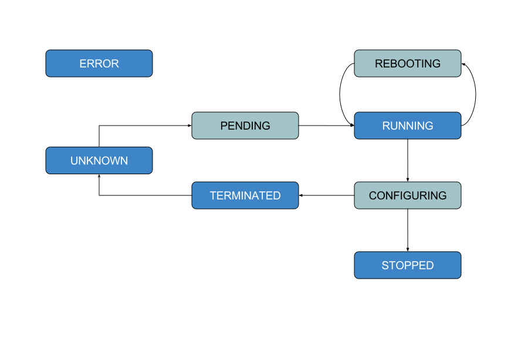
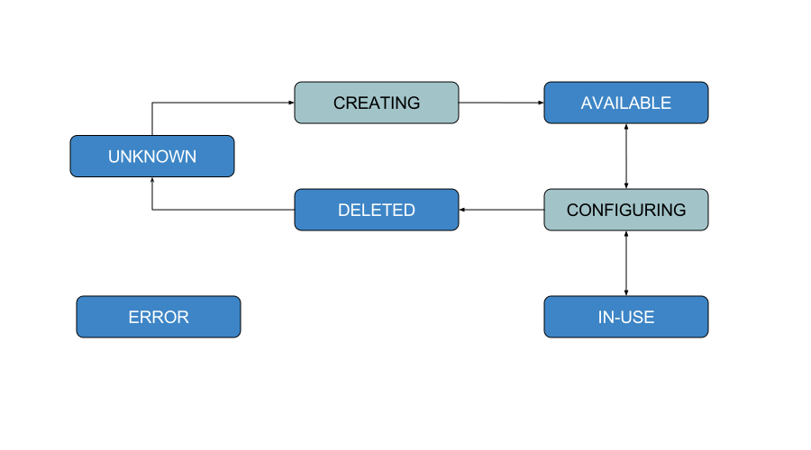
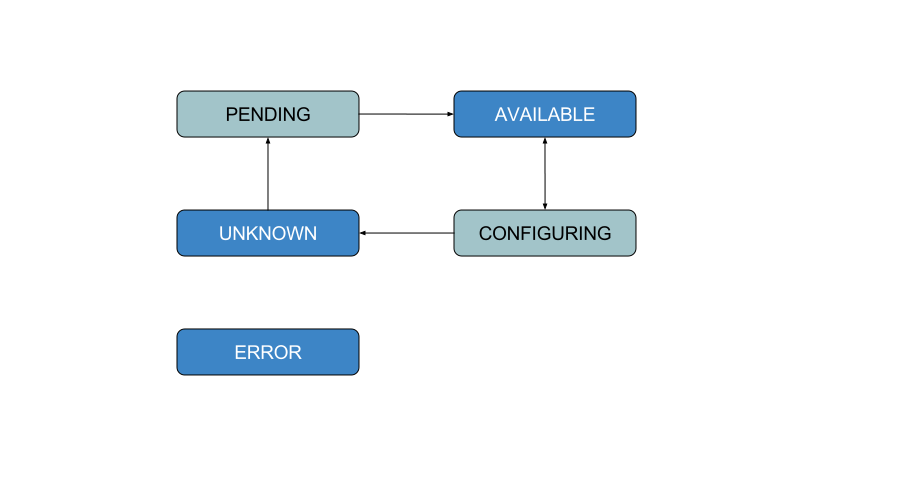
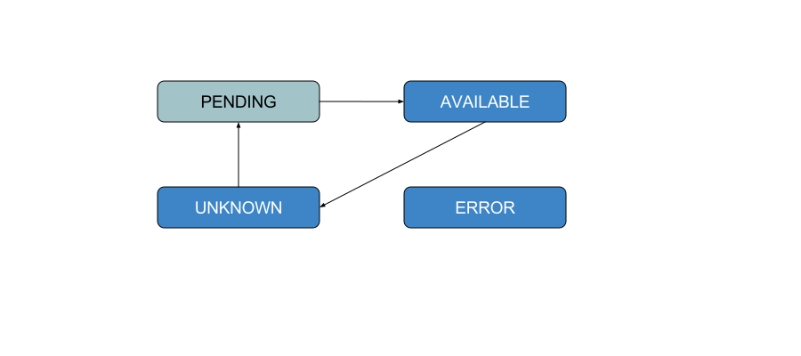

Object states and lifecycles
============================

Overview
--------
Some objects, namely, Instances, Volumes, Snapshots and Images, have a specific
life-cycle and a set of states they can be in. For example, an Instance may
be in state RUNNING and a volume maybe in state AVAILABLE. These provider
specific states are mapped to a common vocabulary of states in CloudBridge.

In addition, it is common to want to wait for objects to reach a particular
state. For example, wait for an instance to transition from PENDING->RUNNING.
To facilitate this, all such objects in CloudBridge implement the
:py:class:`ObjectLifeCycleMixin`. Each object with a lifecycle has a state
property, a refresh method and a wait_for method.

The state property will return the object's current state, and the refresh()
method can be used to requery the server and update the object's state.
The wait_for method can be used to wait for the object to transition to a
desired state or set of states.

There is also a convenience method named wait_till_ready(), which will wait
for the object to reach a ready-to-use state. A ready-to-use state would mean
that the object has been successfully created and can be interacted with, and
is not in an error state. Since this can be tedious to get right, the
wait_till_ready() method encapsulates this behaviour. For example - in the case
of an Instance, wait_till_ready() will internally call the wait_for method as
follows:

.. code-block:: python

    self.wait_for(
        [InstanceState.RUNNING],
        terminal_states=[InstanceState.TERMINATED, InstanceState.ERROR],
        timeout=timeout,
        interval=interval)

This would cause the wait_for method to repeatedly call refresh() till the
object's state reaches RUNNING. It will raise a :class:`WaitStateException`
if the timeout expires, or the object reaches a terminal state, such as
TERMINATED or ERROR, in which case it is no longer reasonable to wait for the
object to reach a running state.

Informational states and actionable states
------------------------------------------
As in the wait_for example above, some states are purely informational, and
some states are actionable. Informational states are meant to provide
information to the end-user, and should generally not be used by program logic
to take actions. For example, it would be incorrect to write a wait_for
function as follows:

.. code-block:: python

    wait_for([InstanceState.PENDING], ...)

This is because the PENDING state is fleeting and may occur too fast to be
reliably detected by the client. In contrast, a state such as RUNNING is more
stable and program logic can reasonably take actions based on such states. In
the discussion that follows, we will specifically differentiate between
informational and actionable states.

Instance states and lifecycle
-----------------------------
The following states are defined for a CloudBridge Instance.

===================   =============   ==================
State                 Category        Description
===================   =============   ==================
UNKNOWN               actionable      Instance state is unknown. This means
                                      that the instance does not exist or
                                      CloudBridge does not know how to map this
                                      state.
PENDING               informational   Instance is pending
CONFIGURING           informational   Instance is being reconfigured in some
                                      way and may not be usable.
RUNNING               actionable      Instance is running.
REBOOTING             informational   Instance is rebooting.
TERMINATED            actionable      Instance is terminated. No further
                                      operations possible.
STOPPED               actionable      Instance is stopped. Instance can be
                                      resumed.
ERROR                 actionable      Instance is in an error state. No further
                                      operations possible.
===================   =============   ==================

The lifecycle diagram is as follows:

Actionable states are shown in blue and informational states in cyan.
Note that any state could potentially transition into an ERROR state.
An Instance may initially be in an UNKNOWN state and transition into
a PENDING state on launch. Similarly, it may transition into an UNKNOWN
state after TERMINATION and the object no longer exists. More rarely, an
instance may transition into an UNKNOWN state if CloudBridge does not know
how to map the state reported by the cloud provider. Therefore, when writing
a wait_for method, these potential transitions should be taken into account.

Volume states and lifecycle
---------------------------
The following states are defined for a CloudBridge Volume.

===================   =============   ==================
State                 Category        Description
===================   =============   ==================
UNKNOWN               actionable      Volume state is unknown. This means that
                                      the volume does not exist or CloudBridge
                                      does not know how to map this state.
CREATING              informational   Volume is pending
CONFIGURING           informational   Volume is being reconfigured in some way
                                      and may not be usable.
AVAILABLE             actionable      Volume is unattached and available for use.
IN_USE                informational   Volume is attached to an instance and in-use.
DELETED               actionable      Volume has been deleted. No further
                                      operations possible.
ERROR                 actionable      Volume is in an error state. No further
                                      operations possible.
===================   =============   ==================

The lifecycle diagram is as follows:

Actionable states are shown in blue and informational states in cyan.
Note that any state could potentially transition into an ERROR state.
A Volume may initially be in an UNKNOWN state and transition into
a CREATING state when created anew. Similarly, it may transition into an UNKNOWN
state after DELETED and the object no longer exists. More rarely, a
volume may transition into an UNKNOWN state if CloudBridge does not know
how to map the state reported by the cloud provider. A Volume will typically
transition through a CONFIGURING stage before going to an IN_USE stage and vice
versa.

Snapshot states and lifecycle
-----------------------------
The following states are defined for a CloudBridge Snapshot.

===================   =============   ==================
State                 Category        Description
===================   =============   ==================
UNKNOWN               actionable      Snapshot state is unknown. This means
                                      that the snapshot does not exist or
                                      CloudBridge does not know how to map this
                                      state.
PENDING               informational   Snapshot is pending
CONFIGURING           informational   Snapshot is being reconfigured in some
                                      way and may not be usable.
AVAILABLE             actionable      Snapshot is ready.
ERROR                 actionable      Snapshot is in an error state. No further
                                      operations possible.
===================   =============   ==================

The lifecycle diagram is as follows:

Actionable states are shown in blue and informational states in cyan.
Note that any state could potentially transition into an ERROR state.
A Snapshot may initially be in an UNKNOWN state and transition into
a PENDING state when created anew. Similarly, it may transition into an UNKNOWN
state after deleted and the object no longer exists. More rarely, a
snapshot may transition into an UNKNOWN state if CloudBridge does not know
how to map the state reported by the cloud provider.

Image states and lifecycle
--------------------------
The following states are defined for a CloudBridge Image.

===================   =============   ==================
State                 Category        Description
===================   =============   ==================
UNKNOWN               actionable      Image state is unknown. This means that
                                      the Image does not exist or CloudBridge
                                      does not know how to map this state.
PENDING               informational   Image is pending
AVAILABLE             actionable      Image is ready.
ERROR                 actionable      Image is in an error state. No further
                                      operations possible.
===================   =============   ==================

The lifecycle diagram is as follows:

Actionable states are shown in blue and informational states in cyan.
Note that any state could potentially transition into an ERROR state.
An Image may initially be in an UNKNOWN state and transition into
a PENDING state when created anew. Similarly, it may transition into an UNKNOWN
state after deleted and the image no longer exists. More rarely, an
Image may transition into an UNKNOWN state if CloudBridge does not know
how to map the state reported by the cloud provider.
