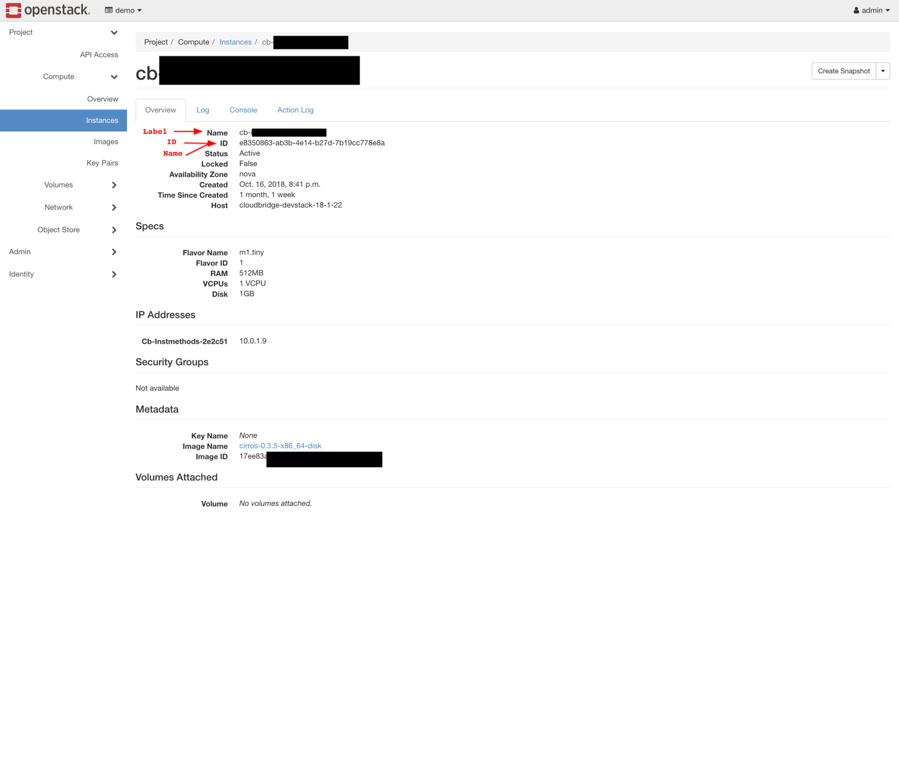
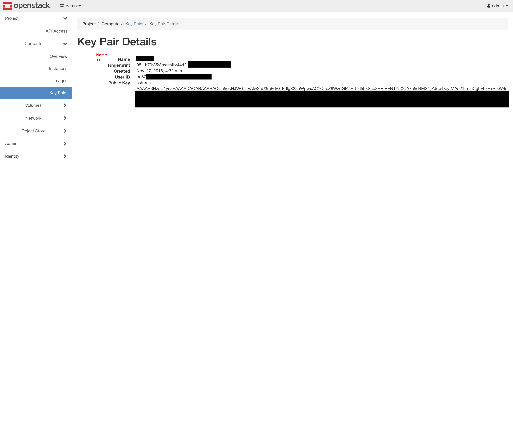

OpenStack - Labeled Resources
-----------------------
+------------------------+------------------------+-----------+----------------+----------+
| Labeled Resource       | OS Resource Type       | CB ID     | CB Name        | CB Label |
+------------------------+------------------------+-----------+----------------+----------+
| OpenStackInstance      | Instance               | ID        | ID             | Name     |
+------------------------+------------------------+-----------+----------------+----------+
| OpenStackMachineImage  | Image                  | ID        | ID             | Name     |
+------------------------+------------------------+-----------+----------------+----------+
| OpenStackNetwork       | Network                | ID        | ID             | Name     |
+------------------------+------------------------+-----------+----------------+----------+
| OpenStackSubnet        | Subnet                 | ID        | ID             | Name     |
+------------------------+------------------------+-----------+----------------+----------+
| OpenStackRouter        | Router                 | ID        | ID             | Name     |
+------------------------+------------------------+-----------+----------------+----------+
| OpenStackVolume        | Volume                 | ID        | ID             | Name     |
+------------------------+------------------------+-----------+----------------+----------+
| OpenStackSnapshot      | Snapshot               | ID        | ID             | Name     |
+------------------------+------------------------+-----------+----------------+----------+
| OpenStackVMFirewall    | Security Group         | ID        | ID             | Name     |
+------------------------+------------------------+-----------+----------------+----------+

The resources listed above are labeled, they thus have both the `name` and
`label` properties in CloudBridge. These resources require a mandatory `label`
parameter at creation. For all labeled resources, the `label` property in OpenStack
maps to the Name attribute. However, unlike in Azure or AWS, no resource has
an unchangeable name by which to identify it in our OpenStack implementation.
The `name` property will therefore map to the ID, preserving its role as an unchangeable 
identifier even though not easily readable in this context. Finally, labeled resources
support a `label` parameter for the `find` method in their corresponding services.
The below screenshots will help map these properties to OpenStack objects in the
web portal.
Additionally, although OpenStack Security Groups are not associated with a
specific network, such an association is done in CloudBridge, due to its
necessity in AWS. As such, the VMFirewall creation method requires a
`network` parameter and the association is accomplished in OpenStack through
the description, by appending the following string to the user-provided description
(if any) at creation: "[CB-AUTO-associated-network-id: associated_net_id]"

   The CloudBridge `name` and `ID` properties map to the unchangeable
   resource ID in OpenStack as resources do not allow for an unchangeable
   name. The `label` property maps to the 'Name' for all resources in 
   OpenStack. By default, this label will appear in the first column.

OpenStack - Unlabeled Resources
---------------------------
+-----------------------+------------------------+-------+---------+----------+
| Unlabeled Resource    | OS Resource Type       | CB ID | CB Name | CB Label |
+-----------------------+------------------------+-------+---------+----------+
| OpenStackKeyPair      | Key Pair               | Name  | Name    | -        |
+-----------------------+------------------------+-------+---------+----------+
| OpenStackBucket       | Object Store Container | Name  | Name    | -        |
+-----------------------+------------------------+-------+---------+----------+
| OpenStackBucketObject | Object                 | Name  | Name    | -        |
+-----------------------+------------------------+-------+---------+----------+

The resources listed above are unlabeled. They thus only have the `name`
property in CloudBridge. These resources require a mandatory `name`
parameter at creation, which will directly map to the unchangeable `name`
property. Additionally, for these resources, the `ID` property also maps to
the `name` in OpenStack, as these resources don't have an `ID` in the
traditional sense and can be identified by name. Finally, unlabeled resources
support a `name` parameter for the `find` method in their corresponding
services.

   KeyPairs and other unlabeled resources in OpenStack have `name` that is
   unique and unmodifiable. The `ID` will thus map to the `name` property when
   no other `ID` exists for that OpenStack resource.

OpenStack - Special Unlabeled Resources
-----------------------------------
+--------------------------+------------------------+-------+------------------------------------------------------------------------+----------+
| Unlabeled Resource       | OS Resource Type       | CB ID | CB Name                                                                | CB Label |
+--------------------------+------------------------+-------+------------------------------------------------------------------------+----------+
| OpenStackFloatingIP      | Floating IP            | ID    | [public_ip]                                                            | -        |
+--------------------------+------------------------+-------+------------------------------------------------------------------------+----------+
| OpenStackInternetGateway | Network `public`       | ID    | 'public'                                                               | -        |
+--------------------------+------------------------+-------+------------------------------------------------------------------------+----------+
| OpenStackVMFirewallRule  | Security Group Rule    | ID    | Generated: [direction]-[protocol]-[from_port]-[to_port]-[cidr]-[fw_id] | -        |
+--------------------------+------------------------+-------+------------------------------------------------------------------------+----------+

While these resources are similarly unlabeled, they do not follow the same
general rules as the ones listed before. Firstly, they differ by the fact
that they take neither a `name` nor a `label` parameter at creation.
Moreover, each of them has other special properties.

The FloatingIP resource has a traditional resource ID, but instead of a
traditional name, its `name` property maps to its Public IP.
Moreover, the corresponding `find` method for Floating IPs can thus help
find a resource by `Public IP Address`.

In terms of the gateway in OpenStack, it maps to the network named 'public.'
Thus, the internet gateway create method does not take a name parameter, and
the `name` property will be 'public'.

Finally, Firewall Rules in OpenStack differ from traditional unlabeled resources
by the fact that they do not take a `name` parameter at creation, and the
`name` property is automatically generated from the rule's properties, as
shown above. These rules can be found within each Firewall (i.e. Security
Group) in the web portal, and will not have any name in the OpenStack dashboard.